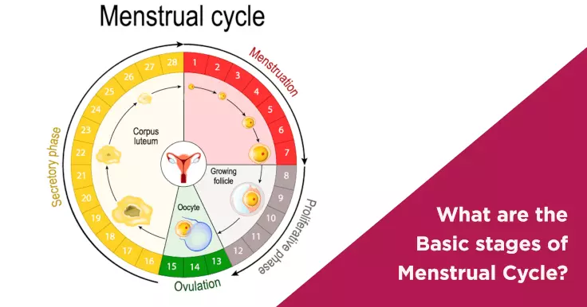

# PregCa

Preg-Ca is a ***Pregnancy Calculator*** that let's you estimate if you & your partner have possibly conseived by using simple Mathematics.

It is estimated that an ovum(egg) can stay up to 48 hours in the fallopian tubes, waiting to be fertilized by a sperm cell,
while a healthy sperm cell(s) can survive up to 5 days waiting to fertilize the ovum.

## Motivation
I was once arguing with my former housemate on which are the best days to have sex in order to avoid or plan for pregnancy. Consequently, we were also teaching our other housemates(non-STEM) over our *Men's Conference* in the kitchen, which they warned 

*'That math of yours will fail you one day'* ,

which we replied 

**'In Mathematics We Trust'** 

now I'm recruiting you to trust it too!😁
